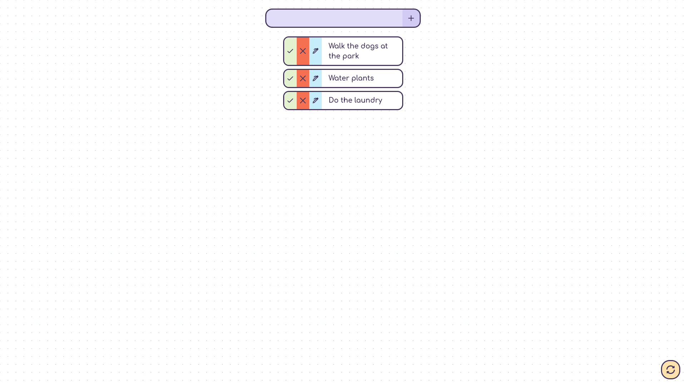

# To-Do App

## Overview
A minimalistic to-do app to keep track of tasks. Features include:
- Check a to-do (toggle)
- Delete a to-do
- Edit a to-do
- Clear to-do list

--- [Live Website]() ---

## Built With
- 💖
- Semantic HTML5 Markup
- CSS Flex & CSS Grid
- CSS Custom Properties
- Vanilla JS
- Mobile-first Workflow

## What I Learned
The main aim of this project was to practice writing my own JavaScript functions, from scratch, and to try and make them as efficient as possible. I'd like to say I succeeded in that aspect! I will continue making progress by writing more complex functions in future projects :)